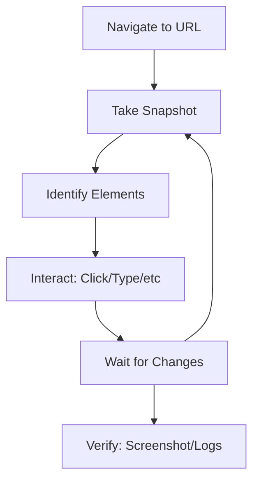

# BrowserMCP Skill

This skill enables MCP Clients to automate browser interactions through the BrowserMCP protocol. It leverages a local MCP server and a Chrome extension to control the user's actual browser session, allowing for authenticated actions and bypassing common bot detection.

## Key Features

- ⚡ **Fast**: Automation happens locally without network latency
- 🔒 **Private**: Browser activity stays on the device
- 👤 **Logged In**: Uses existing browser profile with active sessions
- 🥷 **Stealth**: Avoids basic bot detection and CAPTCHAs via real browser fingerprint

## Prerequisites

Before using BrowserMCP automation:

1. **MCP Server**: BrowserMCP server must be running (via npx)
2. **Chrome Extension**: Browser MCP Chrome extension must be installed and connected
3. **Active Tab**: The target browser tab must be connected via the extension

> [!IMPORTANT]
> The AI can only control tabs that are actively "Connected" via the Browser MCP extension. If you switch tabs, you must reconnect the new tab.

## Core Workflow

The standard browser automation process follows an iterative approach:



### Standard Pattern

| Step | Tool | Purpose | Key Consideration |
|------|------|---------|-------------------|
| **1** | [`navigate`](references/tools.md#browser_navigate) | Open the target URL | Ensure extension is connected first |
| **2** | [`snapshot`](references/tools.md#browser_snapshot) | Capture ARIA tree to identify interactive elements | Refresh after any page changes |
| **3** | [`click`](references/tools.md#browser_click) / [`type`](references/tools.md#browser_type) | Interact with page elements | Use exact `ref` from snapshot |
| **4** | [`wait`](references/tools.md#browser_wait) | Pause for dynamic content to load | Essential after navigation/clicks |
| **5** | [`screenshot`](references/tools.md#browser_screenshot) | Visually verify results | Use when uncertain about state |
| **6** | [`get_console_logs`](references/tools.md#browser_get_console_logs) | Debug JavaScript errors | Check when interactions fail |

## Quick Reference

### Essential Tools

| Tool | Use When | Parameters |
|------|----------|------------|
| `navigate` | Opening a new page | `url` - full URL including protocol |
| `snapshot` | Understanding page structure | None - returns ARIA accessibility tree |
| `click` | Activating buttons/links | `element` (description), `ref` (exact ID from snapshot) |
| `type` | Filling input fields | `element`, `ref`, `text`, `submit` (optional) |
| `hover` | Triggering hover menus | `element`, `ref` |
| `select_option` | Choosing from dropdowns | `element`, `ref`, `values` (array) |
| `press_key` | Keyboard shortcuts | `key` - e.g., "Enter", "Escape", "ArrowDown" |
| `wait` | Allowing page to load | `time` - seconds to wait |
| `screenshot` | Visual verification | None - returns PNG image |
| `get_console_logs` | Debugging errors | None - returns recent console output |
| `go_back` / `go_forward` | Navigation history | None |

### Common Key Values

```
Navigation:    Enter, Escape, Tab
Editing:       Backspace, Delete
Arrows:        ArrowUp, ArrowDown, ArrowLeft, ArrowRight
Modifiers:     Control, Alt, Shift, Meta (combine via modifiers array)
Function:      F1-F12
Other:         Home, End, PageUp, PageDown, Space
```

## Usage Examples

### Example 1: Search on Google

```javascript
// Step 1: Navigate to search engine
navigate(url="https://google.com")

// Step 2: Type search query (use snapshot to find the ref)
type(element="Google search box", ref="e12", text="BrowserMCP automation", submit=true)

// Alternative: Type then press Enter separately
type(element="Search box", ref="e12", text="BrowserMCP automation")
press_key(key="Enter")
```

### Example 2: Fill and Submit a Login Form

```javascript
// Step 1: Navigate to login page
navigate(url="https://example.com/login")

// Step 2: Get snapshot to identify form fields
snapshot()

// Step 3: Fill username field
type(element="Username or email field", ref="e5", text="user@example.com")

// Step 4: Fill password field
type(element="Password field", ref="e7", text="password123")

// Step 5: Click login button
click(element="Sign in button", ref="e9")

// Step 6: Wait for redirect
wait(time=2)

// Step 7: Verify successful login with screenshot
screenshot()
```

### Example 3: Navigate and Extract Information

```javascript
// Navigate to documentation
navigate(url="https://docs.browsermcp.io")

// Wait for page load
wait(time=1)

// Capture accessibility tree to understand structure
snapshot()

// Click on a documentation link
click(element="API Reference link", ref="e15")

// Wait for content to load
wait(time=1)

// Take screenshot for verification
screenshot()

// Check for any JavaScript errors
get_console_logs()
```

### Example 4: Handle Dynamic Content

```javascript
// Navigate to page with dynamic content
navigate(url="https://example.com/dashboard")

// Wait for initial load
wait(time=2)

// Take snapshot to see available elements
snapshot()

// Click element that triggers dynamic content
click(element="Load more button", ref="e22")

// Wait for new content to appear
wait(time=2)

// Refresh snapshot to see new elements
snapshot()

// Interact with newly loaded element
click(element="New item", ref="e45")
```

## Best Practices

### 1. Always Use Snapshots for Element Identification

**Good:**
```javascript
// Take snapshot first, then use exact refs
snapshot()
click(element="Submit button", ref="e12")
```

**Bad:**
```javascript
// Guessing selectors without snapshot
click(element="button.submit")  // May not work with dynamic DOM
```

### 2. Wait After Navigation and Major Actions

Dynamic web applications often load content asynchronously. Always wait after:
- Navigation to a new page
- Clicking buttons that trigger requests
- Submitting forms

```javascript
click(element="Load data button", ref="e8")
wait(time=2)  // Wait for data to load
snapshot()    // Then get fresh page structure
```

### 3. Handle Connection Requirements

Before any automation:
1. Verify the Browser MCP extension is installed
2. Ensure the target tab is connected (user must click "Connect")
3. If connection errors occur, remind the user to reconnect

### 4. Use Screenshots for Debugging

When interactions fail:
```javascript
// Take screenshot to see current page state
screenshot()

// Check console for JavaScript errors
get_console_logs()

// Re-snapshot to see updated element refs
snapshot()
```

### 5. Respect Privacy and Security

- BrowserMCP uses the user's actual browser profile
- Be cautious with sensitive data
- User remains logged into their services
- All actions happen locally on the device

## Reference Navigation

| File | Contents |
|------|----------|
| [`references/setup.md`](references/setup.md) | Detailed installation and configuration for MCP server and Chrome extension |
| [`references/tools.md`](references/tools.md) | Complete tool reference with parameters and detailed examples |
| [`references/best-practices.md`](references/best-practices.md) | Advanced patterns, error handling, and troubleshooting techniques |
| [`references/workflows.md`](references/workflows.md) | Common workflow patterns (forms, authentication, scraping, etc.) |

## Troubleshooting

### Connection Errors

**Error**: "No connection to browser extension"

**Solution**: 
1. User must click the Browser MCP extension icon in Chrome toolbar
2. Click "Connect" button on the target tab
3. Only connected tabs can be automated

### Element Not Found

**Error**: Element reference invalid or element not found

**Solution**:
1. Take a fresh `snapshot()` - the DOM may have changed
2. Use the new `ref` values from the updated snapshot
3. Dynamic content may require `wait()` before snapshot

### Action Blocked or Failed

**Error**: Click/type action didn't work as expected

**Solution**:
1. Take a `screenshot()` to see current page state
2. Check `get_console_logs()` for JavaScript errors
3. Verify element is visible and enabled in snapshot
4. Check for browser-level popups or security prompts
5. Ensure the page has finished loading

### CAPTCHA or Bot Detection

**Note**: BrowserMCP helps avoid basic bot detection by using the real browser profile. However:
- Some sites may still present challenges
- Rate limiting may apply to rapid interactions
- User may need to manually solve some CAPTCHAs

## Comparison: BrowserMCP vs Playwright MCP

| Feature | BrowserMCP | Playwright MCP |
|---------|------------|----------------|
| **Browser** | User's existing browser | New browser instance |
| **Profile** | Uses existing profile with cookies | Isolated profile |
| **Authentication** | Already logged in | Must log in each session |
| **Bot Detection** | Lower (real fingerprint) | Higher |
| **Multi-tab** | One tab at a time | Multiple tabs supported |
| **Best For** | Personal automation, testing logged-in flows | Testing, CI/CD, isolated sessions |

## Tips for Effective Automation

1. **Start with navigate + wait + snapshot** - Establish baseline page state
2. **Use descriptive element names** - Helps with debugging and clarity
3. **Take screenshots at checkpoints** - Visual verification catches issues early
4. **Check console logs after errors** - JavaScript errors explain many failures
5. **Wait strategically** - Too short = flakiness, too long = slowness
6. **Refresh snapshots after interactions** - DOM changes invalidate old refs
7. **Use submit=true for forms** - Cleaner than separate press_key("Enter")
8. **Combine actions efficiently** - Group related operations to minimize round-trips

## Resources

- **BrowserMCP Website**: https://browsermcp.io
- **Documentation**: https://docs.browsermcp.io
- **Chrome Extension**: Search "Browser MCP" in Chrome Web Store
- **GitHub**: https://github.com/browsermcp/mcp
- **Based on**: [Playwright MCP](https://github.com/microsoft/playwright-mcp)
