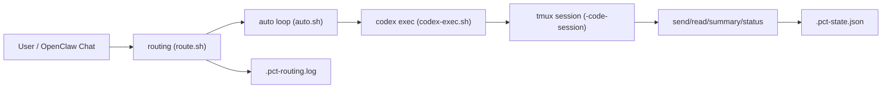

# persistent-code-terminal

A tmux-backed **persistent terminal per project** for OpenClaw.

**Primary use:** run **Codex CLI** (`codex exec`) inside a stable session so you can drive “one-sentence → patch/build/test/commit/push” workflows from desktop or phone (SSH), and always be able to **attach** and see what happened.

## Why this skill

- **Continuity:** keep shell state and output in one place (per project).
- **Observability:** attach to the session and watch progress / take over.
- **Mobile friendly:** disconnect/reconnect without losing the run (as long as the machine stays on).

## Business scenarios

- **团队开发提效:** 把“需求一句话 -> 修改 -> 测试 -> 提交”的闭环放进持久会话，减少上下文丢失和重复操作。
- **远程/移动办公:** 手机 SSH 掉线后任务继续跑，回连即可查看完整输出，不需要重来。
- **发布前稳态操作:** 对多项目并行维护场景，可按项目串行执行并汇总结果，降低误操作风险。
- **审计与复盘:** 终端输出、状态文件、路由日志可追踪，便于定位失败原因和复盘流程。

## Architecture



## Compared with plain CLI

| 维度 | 普通 CLI 直跑 | persistent-code-terminal |
|---|---|---|
| 连接中断 | 任务常中断 | `tmux` 持续运行 |
| 可观察性 | 依赖当前终端窗口 | 随时 `attach/read/summary` |
| 自动闭环 | 需要人工重试 | `auto.sh` 可自动重试 |
| 多项目 | 手工切换上下文 | `list/switch/route` 支持 |
| 结构化集成 | 输出非结构化 | `read/summary/auto --json` |

Session naming:
- `<project-name>-code-session` (derived from current folder name)

---

## Requirements

- macOS or Linux
- `tmux`
- Optional: Codex CLI installed as `codex`

Install tmux:
- macOS: `brew install tmux`
- Ubuntu/Debian: `sudo apt install tmux`

---

## Installation (OpenClaw)

Place this folder as:

- **Project scope (recommended):** `<your-repo>/skills/persistent-code-terminal`
- **Global scope:** `~/.openclaw/skills/persistent-code-terminal`

OpenClaw skill priority follows the documented order (workspace/project skills override global ones).

---

## OpenClaw natural-language setup (CLI backend)

If you want to chat in natural language and let OpenClaw run Codex CLI through this skill, use this checklist:

1. Install this skill in project scope (`<repo>/skills/persistent-code-terminal`).
2. Ensure `codex` is available in the same shell `PATH` used by OpenClaw.
3. Ensure OpenClaw is allowed to execute local shell commands/tools for the workspace.
4. Run doctor once from repo root:

```bash
./skills/persistent-code-terminal/bin/persistent-code-terminal-doctor.sh
```

Doctor will automatically check:
- `tmux` availability
- `codex` availability
- current directory is a git repo
- `tmux` session creation capability

If any check fails, it prints actionable fix commands.

Quick checks:

```bash
command -v codex
command -v tmux
```

Recommended chat wording in OpenClaw:
- "用 persistent-code-terminal 启动会话，然后用 codex 检查项目，不改代码。"
- "用 persistent-code-terminal-send 跑 npm test，超时 120 秒，并给我 summary。"
- "继续上次会话，先看 status，再把失败点修复并提交。"

Recommended shorthand for users:
- Start your message with `codex `, for example:
  - `codex 检查 founder-os 项目，先只读分析，不改代码`
  - `codex 修复当前测试失败，跑测试通过后提交到当前分支`
- In OpenClaw routing, map `codex <instruction>` to:
  - `./skills/persistent-code-terminal/bin/persistent-code-terminal-codex-exec.sh "<instruction>"`

---

## Intelligent auto routing

You can enable auto-routing so coding intents are automatically executed through persistent sessions.

Config toggle (default false):
- `openclaw.config.dev.autoCodeRouting`
- file: `openclaw.config.dev.json`

Enable by setting:

```json
{
  "openclaw": {
    "config": {
      "dev": {
        "autoCodeRouting": true
      }
    }
  }
}
```

Routing entrypoint:

```bash
./skills/persistent-code-terminal/bin/persistent-code-terminal-route.sh "<user message>"
```

Behavior:
- Detects coding workflow intent (code changes, fix/build/test/commit/push, codex usage phrases).
- Safety filters:
  - skips auto-run in non-git directories
  - skips when no action verb is detected
  - honors explicit bypass: `不要执行，只分析`
- Keeps Strategy A:
  - `codex ...` / `用 codex ...` / `使用 codex ...` still force codex instruction parsing.
- Executes:
  - `persistent-code-terminal-auto.sh --max-retries 3 --instruction "<message>"`
  - then `persistent-code-terminal-summary.sh --lines 120`
- Fallback:
  - if missing runtime deps (e.g. tmux/codex), suggests running `doctor.sh`.
- Logs routing decision to `.pct-routing.log`:
  - `detectedIntent`, `triggerReason`, `workingDirIsGitRepo`
  - hidden by default; visible with `--debug`.

---

## Multi-project commands (natural language)

Auto routing supports one message with multiple project tasks, for example:

```text
给 A 项目增加 xx 功能；给 B 项目修复 yyyy 并提交
```

Supported project-task patterns include:
- `给 <project> 项目 <instruction>`
- `给<project>项目：<instruction>`
- `为 <project> 增加/修复/修改 ...`
- `<project> 项目 ...；<project> 项目 ...`

Behavior:
- Splits message by newline / `；` / `;`
- Parses project + instruction per segment
- Runs tasks serially (stable order)
- Invalid/unknown projects are marked failed without blocking other tasks
- For each valid project:
  - ensure session exists
  - run `persistent-code-terminal-auto.sh --max-retries 3 --instruction "<instruction>"`
  - collect concise per-project result

Multi-project example:

```bash
./skills/persistent-code-terminal/bin/persistent-code-terminal-route.sh "给 project-a 项目增加搜索；给 project-b 项目修复测试失败并提交"
```

## Mobile operation example (phone + SSH)

```bash
# 1) 手机 SSH 到开发机，进入仓库
cd ~/work/project-a

# 2) 触发自动闭环任务
./skills/persistent-code-terminal/bin/persistent-code-terminal-auto.sh \
  --max-retries 3 \
  --instruction "修复当前测试失败，测试通过后提交到当前分支，不要 force push"

# 3) 网络波动后重新连接，继续查看
./skills/persistent-code-terminal/bin/persistent-code-terminal-summary.sh --lines 120
./skills/persistent-code-terminal/bin/persistent-code-terminal-attach.sh
```

## Codex integration case

```bash
# 使用 Codex 在持久会话内完成闭环
./skills/persistent-code-terminal/bin/persistent-code-terminal-codex-exec.sh \
  "实现用户设置页并补测试。确保 build/test 通过后提交到当前分支，不要 force push。"

# 结构化读取结果（供自动化/机器人二次处理）
./skills/persistent-code-terminal/bin/persistent-code-terminal-summary.sh --json
```

---

## Quickstart

From your repo root:

```bash
chmod +x skills/persistent-code-terminal/bin/*.sh
./skills/persistent-code-terminal/bin/persistent-code-terminal-start.sh
./skills/persistent-code-terminal/bin/persistent-code-terminal-attach.sh
```

### Run Codex in the persistent session (one sentence)

```bash
./skills/persistent-code-terminal/bin/persistent-code-terminal-codex-exec.sh "Implement: add a settings page with dark mode toggle. Ensure build/test pass. Commit and push to current branch. No force push."
```

Then watch or take over:

```bash
./skills/persistent-code-terminal/bin/persistent-code-terminal-attach.sh
```

---

## Example workflows

### 1) Patch → Build → Test → Commit → Push (Codex-driven)

```bash
./skills/persistent-code-terminal/bin/persistent-code-terminal-codex-exec.sh "Fix the failing tests. Ensure npm run build and npm test pass. Commit with 'fix:' message and push to current branch. No force push."
```

### 2) Dev server (long running)

```bash
./skills/persistent-code-terminal/bin/persistent-code-terminal-start.sh
./skills/persistent-code-terminal/bin/persistent-code-terminal-send.sh "npm run dev"
./skills/persistent-code-terminal/bin/persistent-code-terminal-attach.sh
```

Detach: `Ctrl+b` then `d`. Reattach any time.

---

## Script behavior

- `start.sh`: create the session if missing, otherwise reuse it.
  - `--project <custom-name>`: use `<custom-name>-code-session` for this start call.
- `send.sh`: auto-creates the session if missing, wraps the command with `bash -lc`, and prints `__PCT_EXIT_CODE__N` to pane output when done.
- `read.sh`: auto-creates the session if missing, prints recent pane output, and updates `lastExitCode` from the latest sentinel.
  - `--json`: machine-readable payload with state metadata + `recentOutput`.
- `attach.sh`: auto-creates the session if missing, then attaches.
- `codex-exec.sh`: by default runs:
  - `codex exec --full-auto --sandbox workspace-write --cd <current-dir> "<instruction>"`
  - Pass extra flags before the instruction, for example:
    - `./skills/persistent-code-terminal/bin/persistent-code-terminal-codex-exec.sh --json -o /tmp/codex.json "Implement feature X"`
  - Set `PCT_CODEX_NO_DEFAULT_FLAGS=1` to disable default flags.
- `status.sh`: prints project/session status + last command + last exit code + git clean/dirty.
- `summary.sh`: prints compact header + recent output (`--lines`, default `120`) + error grep section.
  - `--json`: machine-readable payload with state metadata + `recentOutput` + `errorLines`.
- `doctor.sh`: checks tmux/bash/codex availability and tmux session creation ability.
- `list.sh`: list active `*-code-session` tmux sessions (supports `--json`).
- `switch.sh`: attach to an existing session via `--project` or `--session` (does not auto-create).

State file:
- `.pct-state.json` in the current project directory.
- Updated by `start/send/read` with: `projectDir`, `session`, `lastCommand`, `lastExitCode`, `phase`, `updatedAt`.

---

## Send options

- `--dry-run`: print the wrapped command that would be sent; does not send to tmux.
- `--timeout <seconds>`: send command and poll until `__PCT_EXIT_CODE__N` appears, else exit `124`.
- `--phase <name>`: store a lightweight phase label in `.pct-state.json`.

Examples:

```bash
./skills/persistent-code-terminal/bin/persistent-code-terminal-send.sh --timeout 10 "npm test"
./skills/persistent-code-terminal/bin/persistent-code-terminal-summary.sh --lines 80
./skills/persistent-code-terminal/bin/persistent-code-terminal-status.sh
```

```bash
./skills/persistent-code-terminal/bin/persistent-code-terminal-send.sh --dry-run "echo hello"
./skills/persistent-code-terminal/bin/persistent-code-terminal-doctor.sh
```

---

## JSON output mode

For automation/integration, both `read.sh` and `summary.sh` support `--json`:

```bash
./skills/persistent-code-terminal/bin/persistent-code-terminal-read.sh --json
./skills/persistent-code-terminal/bin/persistent-code-terminal-summary.sh --lines 120 --json
```

Notes:
- JSON mode prints strict JSON only (no human-readable headers).
- Metadata comes from `.pct-state.json` (`projectDir`, `session`, `lastCommand`, `lastExitCode`, `phase`, `updatedAt`).
- `summary --json` includes `errorLines` (matches case-insensitive `error|failed|exception`).

---

## Auto closed-loop mode

Use `persistent-code-terminal-auto.sh` to run Codex in a retry loop:

```bash
./skills/persistent-code-terminal/bin/persistent-code-terminal-auto.sh \
  --max-retries 3 \
  --instruction "Fix failing tests and push to current branch"
```

Options:
- `--max-retries <N>`: max attempts (default `3`)
- `--instruction "<text>"`: required initial instruction
- `--timeout <seconds>`: per-attempt timeout (passed to `send.sh` via `codex-exec.sh`)
- `--json`: strict structured output

JSON output shape:
- `success` (boolean)
- `attempts` (number)
- `finalExitCode` (number|null)
- `lastCommand` (string)
- `phase` (string|null)

---

## Multi-project sessions

List active project sessions:

```bash
./skills/persistent-code-terminal/bin/persistent-code-terminal-list.sh
./skills/persistent-code-terminal/bin/persistent-code-terminal-list.sh --json
```

Switch to another project session:

```bash
./skills/persistent-code-terminal/bin/persistent-code-terminal-switch.sh --project project-a
./skills/persistent-code-terminal/bin/persistent-code-terminal-switch.sh --session project-a-code-session
```

Start with custom project session name:

```bash
./skills/persistent-code-terminal/bin/persistent-code-terminal-start.sh --project project-a
```

Example workflow:

```bash
# In project A
./skills/persistent-code-terminal/bin/persistent-code-terminal-start.sh

# In project B
./skills/persistent-code-terminal/bin/persistent-code-terminal-start.sh

# List all
./skills/persistent-code-terminal/bin/persistent-code-terminal-list.sh

# Switch
./skills/persistent-code-terminal/bin/persistent-code-terminal-switch.sh --project project-a
```

---

## Quality checks

This repo includes CI for:
- `shfmt -d` (format check)
- `shellcheck` (lint)
- `bats` (script behavior tests)

---

## Case study (realistic)

See: `examples/case-study-patch-to-push.md`

---

## Security notes

This skill runs local scripts. Review the `bin/` scripts before installing from third parties. Avoid putting secrets in commands or logs.
Tasks that require network or privileged actions (for example `git push`) may still require explicit approval/policy changes depending on your Codex CLI sandbox settings.

---

## License

MIT (see LICENSE if you add it for ClawHub publishing).
