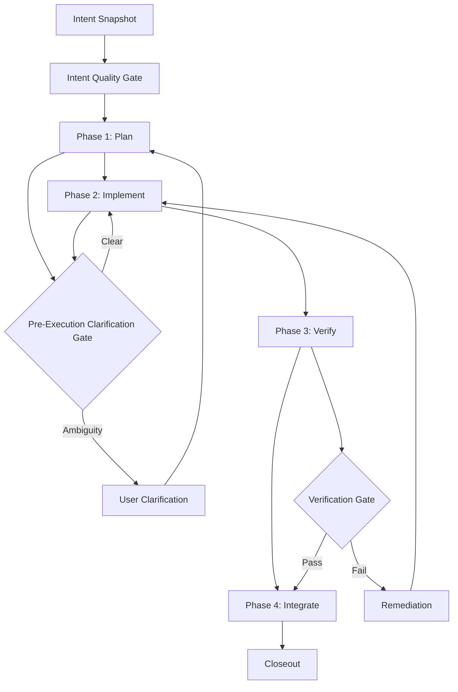

# MVP Spec Mermaid Template

```mermaid
graph TD
    A[Intent Snapshot] --> B[Intent Quality Gate]
    B --> C[Phase 1: Plan]
    C --> D[Phase 2: Implement]
    D --> E[Phase 3: Verify]
    E --> F[Phase 4: Integrate]
    F --> G[Closeout]

    C --> H{Pre-Execution Clarification Gate}
    D --> H
    H -->|Ambiguity| I[User Clarification]
    I --> C
    H -->|Clear| D

    E --> J{Verification Gate}
    J -->|Fail| K[Remediation]
    K --> D
    J -->|Pass| F
```
Copy and edit in the preferred diagram tool.
