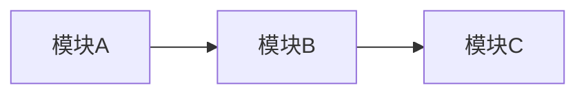

# {{PROJECT_EMOJI}} {{PROJECT_NAME}} — 项目总览

> **灵感来源**: {{INSPIRATION}}
> **技术路线**: {{TECH_STACK}}
> **核心目标**: {{CORE_GOAL}}
> **当前版本**: {{VERSION}}

---

## 📋 文档索引

| 文档 | 内容 | 说明 |
|------|------|------|
| [01-design.md](01-design.md) | 🎯 设计理念 | 项目定位、设计决策、与同类项目的关系 |
| [02-{{DOMAIN_02_SLUG}}.md](02-{{DOMAIN_02_SLUG}}.md) | {{DOMAIN_02_EMOJI}} {{DOMAIN_02_NAME}} | {{DOMAIN_02_DESC}} |
| [03-{{DOMAIN_03_SLUG}}.md](03-{{DOMAIN_03_SLUG}}.md) | {{DOMAIN_03_EMOJI}} {{DOMAIN_03_NAME}} | {{DOMAIN_03_DESC}} |
| [04-{{DOMAIN_04_SLUG}}.md](04-{{DOMAIN_04_SLUG}}.md) | {{DOMAIN_04_EMOJI}} {{DOMAIN_04_NAME}} | {{DOMAIN_04_DESC}} |
| [05-{{DOMAIN_05_SLUG}}.md](05-{{DOMAIN_05_SLUG}}.md) | {{DOMAIN_05_EMOJI}} {{DOMAIN_05_NAME}} | {{DOMAIN_05_DESC}} |
| [06-tech.md](06-tech.md) | ⚙️ 技术架构 | 文件结构、核心类、渲染/请求层次 |
| [07-plan.md](07-plan.md) | 📅 开发计划 | 分期计划、Checklist、里程碑 |
| [08-changelog.md](08-changelog.md) | 📝 更新日志 | 版本历史、Bug修复记录、功能Checklist |
| [09-pitfalls.md](09-pitfalls.md) | 🚧 踩坑记录 | 开发经验教训、注意事项、通用原则 |

---

## 🚀 快速开始

```bash
{{QUICK_START_COMMAND}}
```

## 🏗️ 当前核心系统



<!-- 
架构图说明：
- 使用 Mermaid graph LR（从左到右）或 graph TD（从上到下）
- 每个节点代表一个核心子系统/模块
- 箭头表示数据流或依赖关系
- 节点命名使用中文，简洁明了
-->

### 核心实体/模块概览

| 名称 | 类型 | 简介 | 备注 |
|------|------|------|------|
| {{ENTITY_1}} | {{TYPE_1}} | {{DESC_1}} | {{NOTE_1}} |
<!-- 按实际实体/模块逐行添加 -->

---

<!--
使用说明：
1. 替换所有 {{占位符}} 为实际内容
2. {{PROJECT_EMOJI}} 选择一个代表项目的 emoji
3. 02~05 的域名按项目类型选择：
   - 游戏：map(地图) / npc(NPC) / attributes(属性) / ai(AI系统)
   - Web：routes(路由) / components(组件) / state(状态管理) / api(API)
   - CLI/库：commands(命令) / modules(核心模块) / models(数据模型) / algorithms(算法)
   - 通用：architecture(架构) / modules(核心模块) / models(数据模型) / logic(逻辑)
4. 如果某个 02~05 文件不需要，删除对应行即可
5. 核心实体/模块概览表列出项目中最重要的对象（角色/组件/服务等）
6. {{VERSION}} 格式为 vX.Y（如 v0.1）
-->
