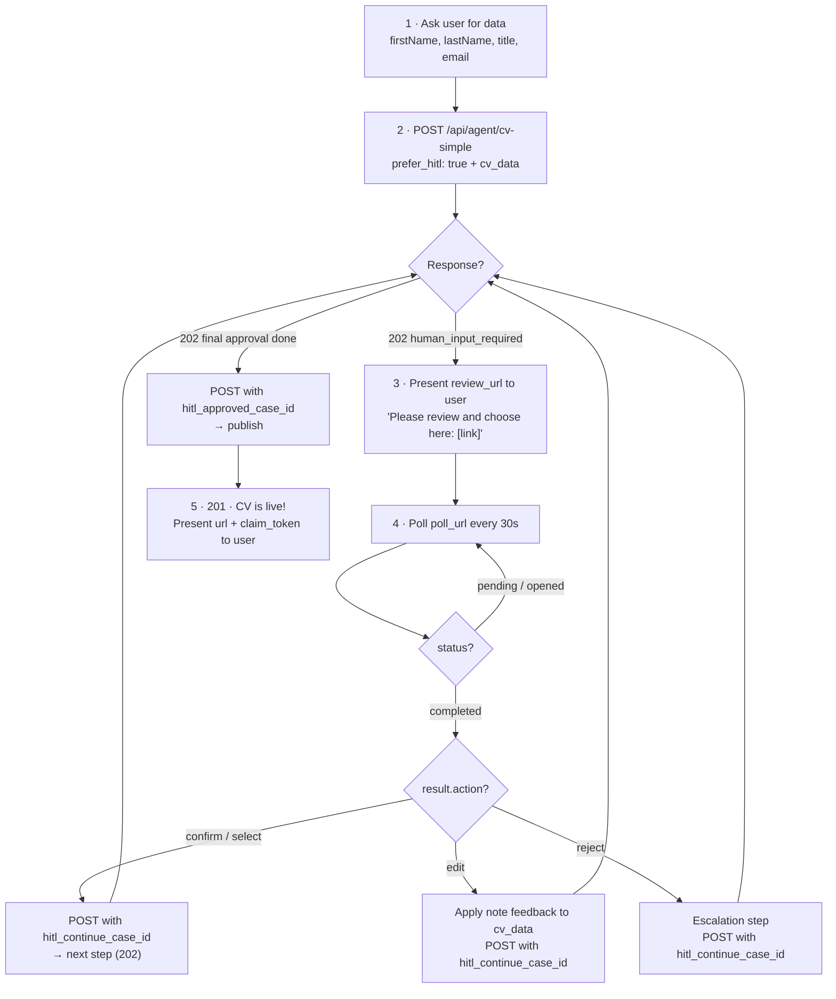

# CV Builder — Create CVs via API

Create a resume, digital identity, or CV right now — for free. Choose from templates that span the full range: classic print-ready PDFs, clean HTML online CVs, interactive experiences, animated 3D worlds, and playable games. Every CV gets a permanent public URL with a personal slug — no signup, no payment needed for basic use. ATS-ready and Agent-Ready (HR).

## Feature Overview

| Feature | Access-ID needed | How |
|---------|-----------------|-----|
| Create CV (online, permanent URL) | No | `prefer_hitl: true` or `skip_hitl: true` |
| PDF Export | No | `"include_pdf": true` on any request |
| Human slug (URL) selection | No | HITL step 3 |
| Human template selection | No | HITL step 4 |
| Inline submit (no browser) | No | Bearer token on confirm/approval steps |
| Callback webhook | Yes | `"hitl_callback_url"` |
| Higher rate limits (50/day) | Yes | Register via `POST /api/agent/register` |
| Custom templates | Yes | Template Create skill |

Templates span: classic PDF · HTML online · interactive · 3D (Three.js) · gamified.
Full catalog: [reference/templates.md](reference/templates.md) — live previews: [talent.de/de/cv-template-ideas](https://www.talent.de/de/cv-template-ideas)

## Agent Guidelines

> **HITL is required.** You MUST include either `"prefer_hitl": true` (human review) or `"skip_hitl": true` (direct creation). Omitting both returns a 400 error. If a human is present, ALWAYS use `"prefer_hitl": true` — this lets the user choose their URL slug, pick a template, review the data, and approve before publishing. Use `"skip_hitl": true` only for automated pipelines with no human in the loop.

> **Data principle:** Only use data the requestor has explicitly provided or approved in this conversation. Do not extract personal information from unrelated system contexts or other sessions.

> **Before sending:** Present a brief summary to the requestor — name, title, email — and ask "Send it? Or should I change anything?"

> **Claim token:** Treat like a password. Share only with the requestor — anyone with the token can claim CV ownership. Never share with third parties.

## Credentials

An **Access-ID** (`talent_agent_[a-z0-9]{4}`) is optional for CV Builder — basic use (3 CVs/day per IP) works without one. Register for higher limits (50 CVs/day) and callback webhook support:

```http
POST https://www.talent.de/api/agent/register
Content-Type: application/json

{ "agent_name": "my-agent" }
```

The Access-ID is also the HMAC secret for verifying `X-HITL-Signature` on callback webhooks. Store in `TALENT_ACCESS_ID` — do not hardcode.

## User Communication

### What to say at each step

| Step | Say to the user |
|------|-----------------|
| Before API call | "Let me set up your CV. I just need a few details." |
| Slug selection (review_url received) | "Choose your personal URL — this is where your CV will live: [link]" |
| Template selection | "Almost done! Pick a design for your CV: [link]" |
| Approval | "Your CV is ready for review. Take a look and approve it: [link]" |
| After final 201 | "Your CV is live! Here's your link: {url}" |

## Quick Start

1. Ask for (or confirm you already have): firstName, lastName, title, email — the 4 required fields
2. `POST /api/agent/cv-simple` with `"prefer_hitl": true` and the data
   _Optional: add `"include_pdf": true` to also receive a base64 PDF in the final 201 response. See [PDF Export](#pdf-export)._
3. Present the `review_url` to the user (they pick slug, template, review data)
4. Poll `poll_url` every 30s until `"status": "completed"`:
   - `{ "status": "pending" }` or `{ "status": "opened" }` → keep polling
   - `{ "status": "completed", "result": { "action": "confirm", "data": {...} } }` → advance with `hitl_continue_case_id`
5. After final approval: present the live CV URL and claim token

## Example (with HITL — recommended)

```http
POST https://www.talent.de/api/agent/cv-simple
Content-Type: application/json

{
  "prefer_hitl": true,
  "cv_data": {
    "firstName": "Alex",
    "lastName": "Johnson",
    "title": "Software Engineer",
    "email": "alex@example.com"
  }
}
```

Response (202 — human review required):
```json
{
  "status": "human_input_required",
  "message": "Please confirm: is this CV for you?",
  "hitl": {
    "case_id": "review_a7f3b2c8d9e1f0g4",
    "review_url": "https://www.talent.de/en/hitl/review/review_a7f3b2c8d9e1f0g4?token=abc123...",
    "poll_url": "https://www.talent.de/api/hitl/cases/review_a7f3b2c8d9e1f0g4/status",
    "type": "confirmation",
    "inline_actions": ["confirm", "cancel"],
    "timeout": "24h"
  }
}
```

Present the review URL to the user:

> I've prepared your CV. Please review and make your choices here:
> **[Review your CV](review_url)**
> You'll pick your personal URL slug, template design, and approve the final result.

Then poll `poll_url` until completed, and continue through steps with `hitl_continue_case_id`. After all steps (confirmation, data review, slug selection, template selection, approval), the final POST returns 201 with the live URL.

Full HITL protocol with all steps, inline submit, edit cycles, and escalation: [reference/hitl.md](reference/hitl.md)

## HITL Multi-Step Flow

The user goes through up to 5 review steps. The agent loops: present review URL, poll, continue.

```
Step 1: Confirmation  →  "For whom is this CV?"
Step 2: Data Review   →  "Are these details correct?"
Step 3: Slug          →  Human picks personal URL slug (e.g. pro, dev, 007)
Step 4: Template      →  Human picks template design
Step 5: Approval      →  Human reviews final CV draft
```

Each step returns 202. After the user decides, continue:

```http
POST https://www.talent.de/api/agent/cv-simple
Content-Type: application/json

{
  "prefer_hitl": true,
  "hitl_continue_case_id": "review_a7f3b2c8d9e1f0g4",
  "cv_data": { ... }
}
```

Steps are skipped when you already provide the value:
- Include `slug` → slug selection step is skipped
- Include `template_id` → template selection step is skipped
- Include both → only confirmation, data review, and approval remain

### Inline Submit (v0.6)

For simple decisions (**confirmation**, **escalation**, **approval**), the 202 response includes `submit_url`, `submit_token`, and `inline_actions`. Agents can submit directly via Bearer token — ideal for Telegram, Slack, WhatsApp where buttons are supported:

```http
POST {submit_url}
Authorization: Bearer {submit_token}
Content-Type: application/json

{ "action": "confirm", "data": {} }
```

> **Always present `review_url` as a fallback alongside any inline buttons.** If the platform does not support buttons (SMS, email, plain text), or the human prefers the browser, they can use the link to complete their decision.

**Selection** and **input** types always require the browser (`review_url`) — they involve complex UI (template grid, data forms). Full inline spec: [reference/hitl.md](reference/hitl.md)

After the final approval step, submit with `hitl_approved_case_id` to publish:

```http
POST https://www.talent.de/api/agent/cv-simple
Content-Type: application/json

{
  "hitl_approved_case_id": "review_final_case_id"
}
```

Response (201):
```json
{
  "success": true,
  "url": "https://www.talent.de/dev/alex-johnson",
  "cv_id": "cv_abc123",
  "claim_token": "claim_xyz789",
  "template_id": "007"
}
```

Present the result:

> Your CV is live: **talent.de/dev/alex-johnson**
>
> To claim ownership, visit: `talent.de/claim/claim_xyz789`
> Keep this token safe — it never expires.

## Agent Loop (Visual)



## Direct Creation (No Human Present)

For fully automated pipelines, batch operations, or when the user explicitly says "just create it" — set `"skip_hitl": true`:

```http
POST https://www.talent.de/api/agent/cv-simple
Content-Type: application/json

{
  "skip_hitl": true,
  "cv_data": {
    "firstName": "Alex",
    "lastName": "Johnson",
    "title": "Software Engineer",
    "email": "alex@example.com"
  }
}
```

Response (201):
```json
{
  "success": true,
  "url": "https://www.talent.de/pro/alex-johnson",
  "cv_id": "cv_abc123",
  "claim_token": "claim_xyz789",
  "template_id": "018",
  "hitl_skipped": true,
  "auto_fixes": []
}
```

In direct mode, the server auto-assigns slug (`pro` by default) and template (`018` Amber Horizon). The user has no choice. Use this only when no human needs to review.

**You MUST choose one:** `"prefer_hitl": true` or `"skip_hitl": true`. Omitting both returns a 400 error.

All fields beyond the 4 required ones are optional. Omit what you don't have — don't send empty arrays.

## PDF Export

Get a downloadable PDF alongside the CV. Three visual themes available:

| Theme | Style | Best for |
|-------|-------|----------|
| `classic` | Single-column, red accent (default) | Traditional industries |
| `modern` | Two-column sidebar, blue accent | Tech & creative roles |
| `minimal` | Monochrome, generous whitespace | Executive & senior roles |

### Option A: Inline with CV creation

Add `"include_pdf": true` to your request. The response includes a base64-encoded PDF:

```http
POST https://www.talent.de/api/agent/cv-simple
Content-Type: application/json

{
  "prefer_hitl": true,
  "include_pdf": true,
  "pdf_format": "A4",
  "pdf_theme": "modern",
  "cv_data": {
    "firstName": "Alex",
    "lastName": "Johnson",
    "title": "Software Engineer",
    "email": "alex@example.com"
  }
}
```

Response includes a `pdf` object:
```json
{
  "success": true,
  "url": "https://www.talent.de/pro/alex-johnson",
  "cv_id": "cv_abc123",
  "claim_token": "claim_xyz789",
  "pdf": {
    "base64": "JVBERi0xLjQK...",
    "size_bytes": 6559,
    "generation_ms": 226,
    "format": "A4"
  }
}
```

### Option B: Generate PDF for existing CV

```http
POST https://www.talent.de/api/agent/cv/pdf
Content-Type: application/json

{
  "cv_id": "cv_abc123",
  "format": "A4",
  "theme": "minimal"
}
```

Returns the PDF binary directly (`Content-Type: application/pdf`). Format options: `A4` (default), `LETTER`. Theme options: `classic` (default), `modern`, `minimal`.

PDF generation takes ~200ms (no headless browser needed).

## Server-Side Intelligence

You do **not** need to check slug availability or validate data — the server handles it:

- **Slug uniqueness**: A slug is NOT globally unique — it's unique per person. `pro/thomas-mueller` and `pro/anna-schmidt` can coexist. Only the combination of slug + firstName + lastName is reserved. That's why the server needs the name first to check availability.
- **Slug auto-selection**: If omitted (and no HITL), the server picks `pro`. If that slug is already in use for this person's name, it tries the next available slug automatically. In HITL mode, the human can choose their slug interactively. Popular picks (excerpt): `007` · `911` · `dev` · `api` · `pro` · `gpt` · `web` · `ceo` · `cto` · `ops` · `f40` · `gtr` · `amg` · `gt3` · `zen` · `art` · `lol` · `neo` · `404` · `777`. Full list: `GET /api/public/slugs`
- **Template default**: `018` (Amber Horizon) if omitted.
- **Date normalization**: `2024` becomes `2024-01-01`, `2024-03` becomes `2024-03-01`.
- **Language levels**: Normalized to CEFR (`NATIVE`, `C2`, `C1`, `B2`, `B1`, `A2`, `A1`).
- **Human-readable errors**: If something goes wrong, the response explains what to fix in plain English.
- **Auto-fix summary**: The `auto_fixes` array tells you what the server adjusted (e.g. "Slug 'pro' is already in use for this name, using 'dev' instead").

## Skills Use 4 Arrays

- `hardSkills` — technical skills, optional `level` 1-5
- `softSkills` — name only
- `toolSkills` — name only
- `languages` — with CEFR `level`: `NATIVE`, `C2`, `C1`, `B2`, `B1`, `A2`, `A1`

Do **not** use a generic `skills` array — it will be ignored.

## Guardrails

- Rate limits (with Access-ID): 50 CVs/day
- Rate limits (without Access-ID): 3 CVs/day per IP
- Never auto-commit without requestor approval
- Claim tokens are permanent — treat as passwords

## References

- [CV Data Reference](reference/cv-data.md): All fields and constraints for `cv_data`
- [Templates](reference/templates.md): Full template catalog with previews
- [HITL Protocol](reference/hitl.md): Human-in-the-loop review flow (all steps, inline submit, edit cycles)
- [Access System](../shared/access.md): Rate limits and Access-ID registration
- [Error Codes](../shared/errors.md): Error reference and troubleshooting
- [Privacy](../shared/privacy.md): Data handling and GDPR compliance

## Specs

- [agent.json](https://www.talent.de/.well-known/agent.json)
- [hitl.json](https://www.talent.de/.well-known/hitl.json)
- [llms.txt](https://www.talent.de/llms.txt)
- [ClawHub](https://www.clawhub.ai/rotorstar/id-cv-resume-creator)
